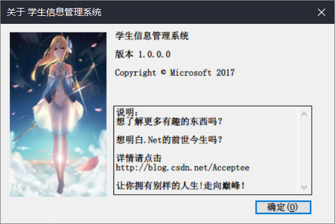

# 学生信息管理系统

> 一个功能强大的学生信息管理系统

## 背景

1. 实训项目（*本人大一学生党，不得不向恶势力低头...*）

2. 锻炼自己的水平

    

## 技术栈

1. 前端: WinForm
2. 后端: C#
3. 数据库: SQL 2016

## 环境

1. 系统 Win10专业版 1709
2. 数据库 SQL 2008R2 | SQL 2016
3. C# 4.5框架 （向下兼容）
4. 编辑器 Visual Studio 2017 15.15.2 

## 截图

（未安装开发环境，截图无法全部展示）

## 协议

无
